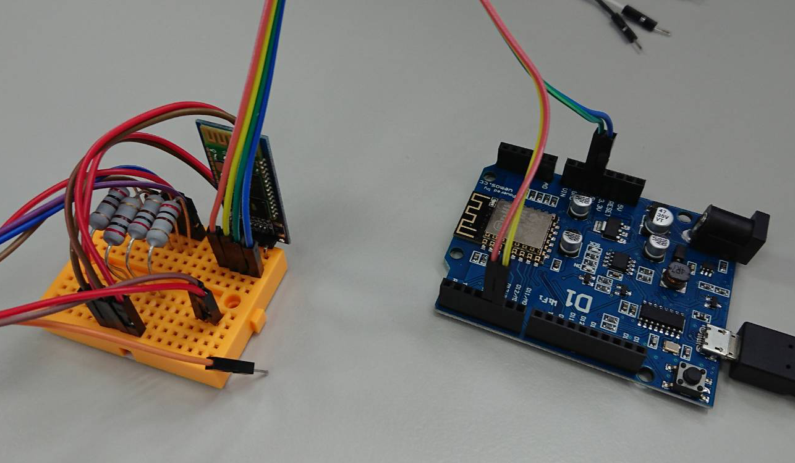

# Arduino Example
This is an arduino example which can connection between HC-06 and Dualshock 4

# Pinset

| Arduino | HC-05/06 |
|---------|----------|
| 5V      | 5V       |
| GND     | GND      |
| TX      | D5       |
| RX      | D4       |

