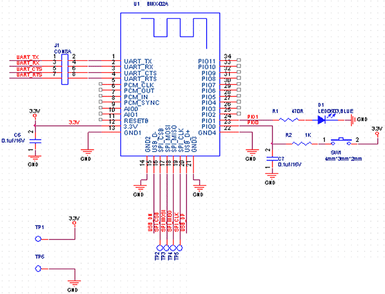
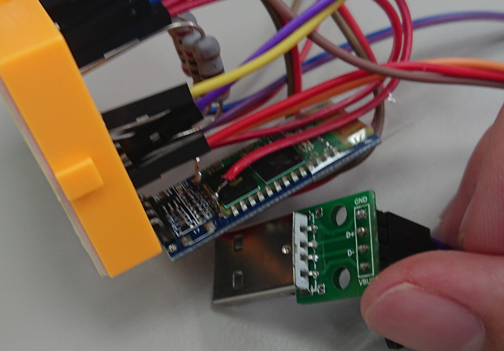
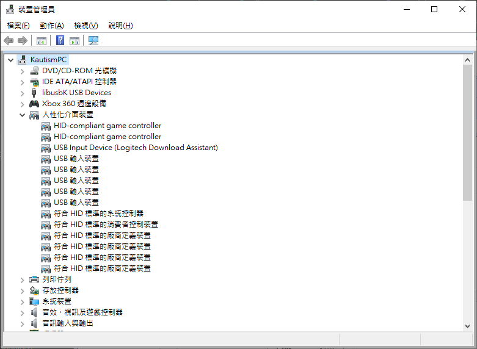
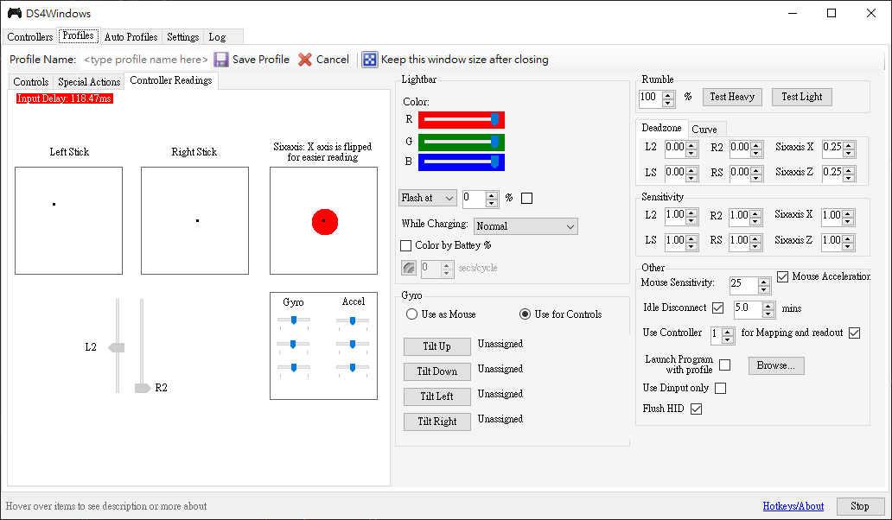

#  Custom firmware for HC-05/06 to connect DS4

Please see [arduino example](arduino_example) or [golang example](golang_example)

If you wanna find pre-compiled firmware, please see [release](https://github.com/darkautism/HC-05-Dev/releases)

## USB Mode guide

This custom firmware will allow you to use HC-05/HC06 as a Dualshock 4 dongle.

First, you should weld D+ and D- pin. And buy a USB type A connector.

Burn the custom firmware into your HC-06/HC-05. Plugin this usb into windows.

Game controller can recognize our device now!

## Know issue

- Input delay too high (more than 100ms)